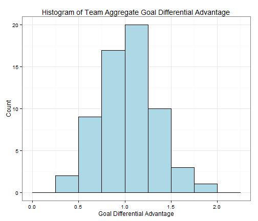
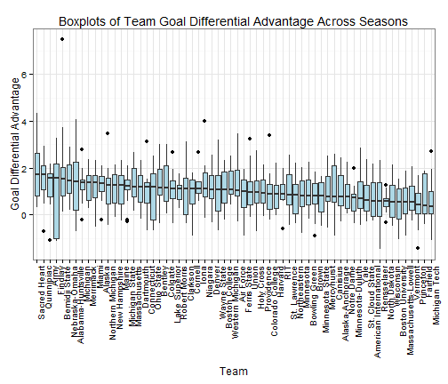
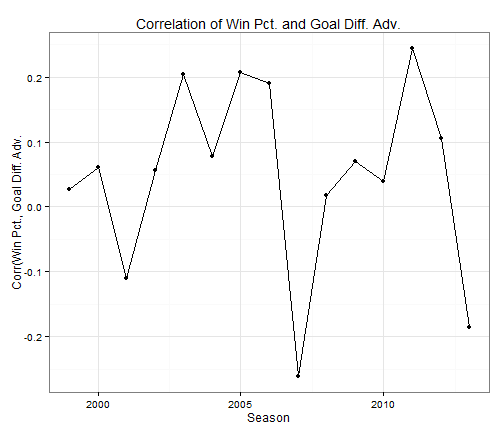

Home Ice Advantage in College Hockey
====================================

As a Cornell hockey fan, I've often heard Cornell's home rink, Lynah Rink, described as a tough place for opposing teams to play. Recently, I've started to wonder if that's actually true, and if so, what it means. Is Lynah a tough place to play because you have to play Cornell there, and they have typically had strong teams? Or does Cornell have  a particularly strong home ice advantage? More generally, does home ice advantage exist in college hockey, and if so, how is it characterized?

This is not intended as a very technical analysis. In fact, is as much an exercise in learning to scrape data from the web, use RStudio, and produce a report using R Markdown. But I hope to address a handful of questions about home ice advantage in college hockey. Specifically:
* How should home ice advantage be measured?
** Better winning percentage at home?
** More goals scored at home?
** Fewer goals allowed at home?
** Higher goal differential at home?
* Does home ice advantage exist?
* Is the overall level of home ice advantage across college hockey stable over time?
* Are individual teams' home ice advantages stable over time?

Measuring Home Ice Advantage
----------------------------

Does Home Ice Advantage Exist?
------------------------------

The answer to this question is a resounding YES! Over the past fifteen seasons (1998-2013), 86.6% of team-seasons experienced a higher goal differential at home than on the road. Over the entire fifteen year period, every single team has had a positive aggregate goal differential advantage. The following histogram shows the distribution of team aggreagate advantage over the sample period.

 

 

 

